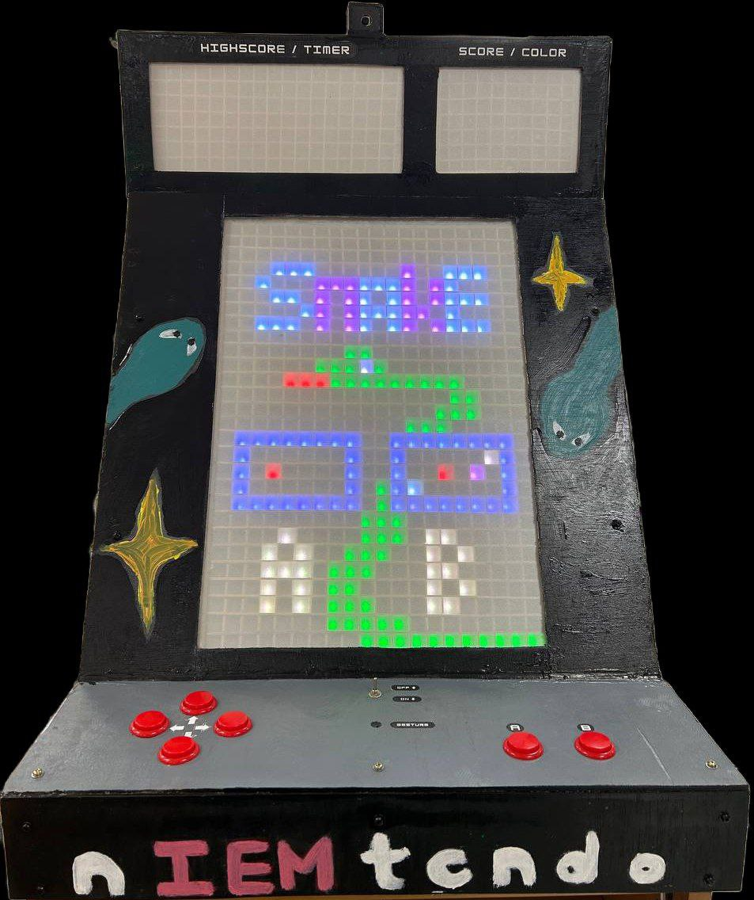

# DIPgroup3 - nIEMtendo

This project implements a Snake game on an Arduino platform using LED matrices. It includes two game modes: classic snake and a mode where the snake needs to eat apples based on their colors.

## Table of Contents
- [Introduction](#introduction)
- [Meet The Team](#meet-the-team)
- [Features](#features)
- [Hardware Requirements](#hardware-requirements)
- [Software Requirements](#software-requirements)
- [Installation](#installation)
- [Usage](#usage)
- [Game Modes](#game-modes)
- [Controls](#controls)
- [Contributing](#contributing)
- [License](#license)

## Introduction

This project utilizes Arduino and FastLED library to create a snake game that can be played on LED matrices. The game offers two distinct modes, allowing players to experience both classic snake gameplay and a unique mode based on apple colors.

## Meet the Team

| Sub Team | Name |
| ------------- | ------------- |
| Project Lead | Samuel Loon  |
| Hardware Team  | Ong Yu Heng   Eliza H. Tanpoco   Ang Kai Xun  |
| Software Team  | Lee Si, Heidi   Claire Chai Xin Yi   Angel Low Shu Hui   Joshua Pok  |
| Computer Vision Team  | Wen Xi Xiong   Ng Zheng Ning |

## Features

- Classic snake gameplay with adjustable speed.
- Alternate game mode where the snake eats apples according to their colors.
- LED matrix-based display for an engaging gaming experience.
- Gesture and button-based controls for navigating the snake.

## Hardware Requirements

- Arduino Mega 2560 CH340
- Raspberry Pi 4 Model B
- Pi Camera3
- WS2812B LEDS (749 leds)
- Gesture sensor (DFRobot_PAJ7620U2)
- Generic arcade buttons for controls
- Frosted acrylic screen
- Speakers with AUX cable
- Speaker Module

## Software Requirements

- Arduino IDE
- Python
- FastLED library
- Adafruit NeoMatrix libary
- DFRobot_PAJ7620U2 library
- LinkedList library 

## Installation

1. Clone the repository to your local machine.
2. Open the Arduino IDE.
3. Install the required libraries mentioned in the [Software Requirements](#software-requirements).
4. Connect your Arduino board and configure the board settings.
5. Upload the code to your Arduino.

## Usage

1. Wire up the hardware components as per the provided schematics.
2. Upload the code to your Arduino.
3. Power up the Arduino and start playing the game.

## Game Modes

### Classic Snake Game
- Control the snake using buttons or gestures.
- Eat apples and avoid collisions with the snake's body or boundaries.

### Apple Color Mode
- The snake needs to eat apples according to their colors.
- Each apple has a different color, and the snake must eat apples matching a specified color.

## Controls

- Button A: Move down
- Button B: Move left
- Button C: Move up
- Button D: Move right
- Gesture Sensor: Alternate control method based on gestures (if enabled)
- Computer Vision Based control: Alternate control method based on Computer Vision (if enabled)

## Contributing

Contributions are welcome! Fork the repository and create a pull request for any enhancements, bug fixes, or new features.

## License

This project is licensed under the [MIT License](LICENSE).
